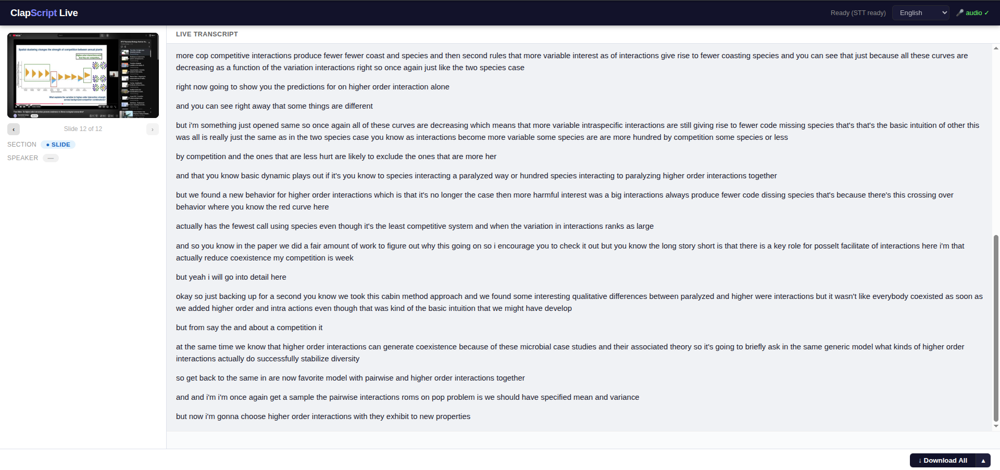

# ClapScript Live

Real-time slide detection, speaker identification, and transcription in the browser. Live counterpart to [ClapScript](https://github.com/NitroxHead/ClapScript).



Share your screen while presenting or attending a talk. Slide thumbnails appear on transitions, the transcript rolls in as people speak, and speakers are labeled when faces are detected.

## How it works

- Browser captures screen + audio via `getDisplayMedia` and streams JPEG frames (1fps) + PCM audio over a WebSocket
- Server detects slide transitions and faces using the same pixel-diff and DNN logic as ClapScript
- [Vosk](https://alphacephei.com/vosk/) provides streaming speech-to-text with partial results, text appears as you speak

## Usage

```bash
pip install fastapi "uvicorn[standard]" vosk opencv-python numpy
cd live && python3 server.py
```

Open **http://localhost:8000** in Chrome. Click **Start**, share a browser tab, and tick **Share audio** in the dialog.

## Features

- Slide thumbnails update on transitions
- Click any slide for full-size view, navigate with ‹/›, delete with the Delete key
- Transcript appears line-by-line in real time, speaker labels added when identified
- Language dropdown, Vosk models for 15 languages auto-downloaded on first use (~40MB each)
- Download: All (transcript + slides as zip), Transcript only (.md), or Slides only (.zip)

## Dependencies

```
fastapi  uvicorn[standard]  vosk  opencv-python  numpy
```

The OpenCV DNN face model (~5MB) and Vosk language models are downloaded automatically on first run.

## Architecture

```
live/
  server.py        FastAPI app, WebSocket, frame processing, Vosk STT
  static/
    index.html     Single-page UI (no build step)
```

`server.py` imports face detection and slide-diff logic directly from `extract_slides.py` in the repo root. The core algorithms are unchanged from ClapScript, only the transport layer (WebSocket instead of video file) and speaker clustering (incremental instead of batch) differ.

## Known gaps

**Speaker diarization** - speaker identification is face-based and only works when a camera feed is visible.

**Audio capture** - browsers limit what audio `getDisplayMedia` can capture depending on what is being shared. Capturing audio from arbitrary windows or system-wide is not reliably possible from a web page alone.

## License

MIT
